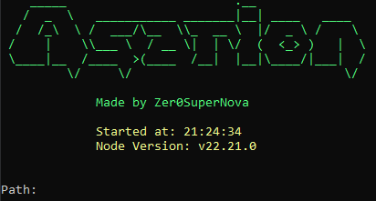

# Asarion

### Asarion is a security research tool for auditing Electron applications.

## What it does

Electron apps package their source code in `.asar` archives. Asarion operates in two stages:

**1. Fuse Patching**
Electron binaries ship with "fuses" — hardcoded feature flags baked into the binary. Asarion patches these directly to enable security research capabilities, such as disabling ASAR integrity validation.

**2. ASAR Entry Point Patching**
Rather than the common extract→modify→repack approach (which frequently breaks apps due to offset corruption), Asarion patches the `package.json` main entry point **directly inside the ASAR binary** in-place. This preserves all file offsets and keeps the archive intact.

A loader is placed alongside the ASAR which runs before the original entry point, enabling runtime inspection of the application.

## Why in-place patching?

Standard extract/repack tooling breaks apps because repacking recalculates file offsets, corrupting native module references and symlinks. Direct binary patching avoids this entirely.

## Use cases

- Electron app security auditing
- Runtime analysis and hook injection for research
- Understanding Electron attack surface for defensive purposes

## Requirements

- Node.js
- Target Electron app with accessible `resources/` directory
